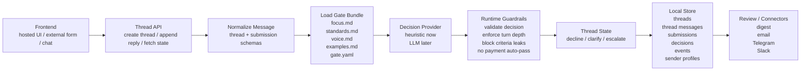

# OpenGates OSS MVP

Local-first, agent-native inbound gate runtime.

## What This Includes
- a minimal FastAPI reference UI for hosted gate threads
- a local thread engine that processes each turn into `decline`, `clarify`, or `escalate`
- a Markdown-first gate bundle
- local thread, message, decision, and sender storage
- a starter gate under `gates/demo-investor`
- API routes for external form/chat frontends

## Architecture


## How It Works
1. A sender starts a thread through the built-in web UI or an external client.
2. The runtime converts the inbound turn into stable thread and submission schemas.
3. OpenGates loads the gate bundle for that thread's gate.
4. The provider decides `decline`, `clarify`, or `escalate` for the current turn.
5. The runtime applies guardrails and enforces remaining clarification rounds.
6. The thread state, messages, decision, event log, and sender profile are persisted locally.
7. The built-in UI or an external client can fetch the updated thread and render the next step.

## Quick Start
```bash
cd oss
uv sync
uv run opengates serve --host 127.0.0.1 --port 8000
```

Open [http://127.0.0.1:8000](http://127.0.0.1:8000).

Fastest test route:
- [http://127.0.0.1:8000/demo](http://127.0.0.1:8000/demo)

## Gate Bundle
Each gate lives in `gates/<gate_id>/` with:
- `focus.md`
- `standards.md`
- `voice.md`
- `examples.md`
- optional `gate.yaml`

These files define:
- what the user cares about
- what quality bar must be met
- how replies should sound
- examples that sharpen the gate's judgment
- thread depth and route behavior through `gate.yaml`

## Current Runtime
The current MVP ships with a deterministic heuristic provider so the system runs out of the box. The provider boundary is explicit so a real model adapter can replace it without changing the thread engine, storage, or gate bundle contract.

## Reference UI And API
The built-in web app is a reference client for the thread engine. External frontends can use the same engine over API.

Useful routes:
- `GET /demo`
- `GET /g/{gate_id}`
- `GET /t/{thread_id}`
- `POST /api/gates/{gate_id}/threads`
- `GET /api/threads/{thread_id}`
- `POST /api/threads/{thread_id}/reply`

## Provider Strategy
- `HeuristicDecisionProvider`: catches obvious spam, applies explicit reject rules, and handles no-key local mode
- future LLM provider: handles ambiguous judgment, better tone, stronger few-shot use, and richer summaries
- runtime guardrails stay outside both, so behavior remains auditable and stable

## OpenAI Provider
To use a real model:

```bash
cp .env.example .env
```

Set:
```bash
OPENGATES_PROVIDER=openai
OPENAI_API_KEY=your_key_here
OPENGATES_OPENAI_MODEL=gpt-5-mini
OPENGATES_DEBUG_PROMPTS=1
```

Notes:
- `heuristic` mode works without any key
- `openai` mode uses the OpenAI Responses API with structured output parsing
- obvious spam still gets short-circuited by heuristics before the model call
- if the OpenAI call fails, the runtime falls back to the heuristic provider

## Repo Shape
```text
oss/
  gates/
    demo-investor/
  src/opengates/
    app.py
    runtime.py
    gates.py
    storage.py
    schemas.py
    providers/
    templates/
  tests/
```

## Commands
```bash
uv run opengates list-gates
uv run opengates init-gate --from demo-investor --to my-gate
uv run opengates serve
```

## Tests
```bash
uv run pytest
```
